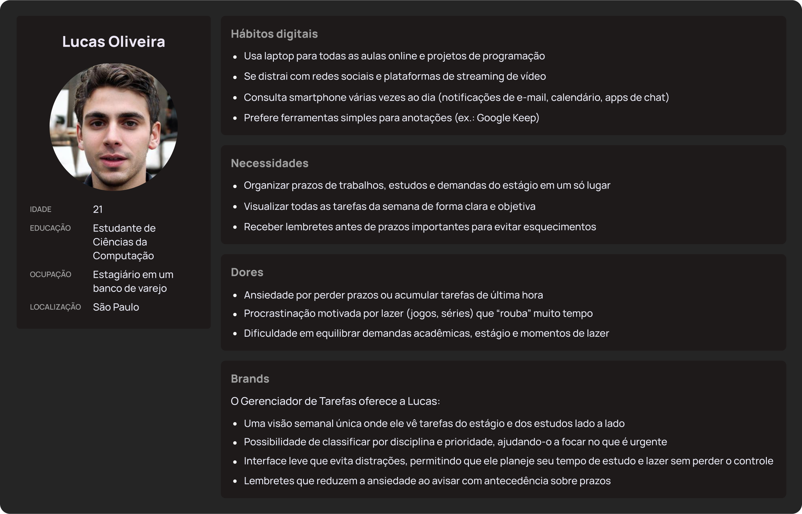
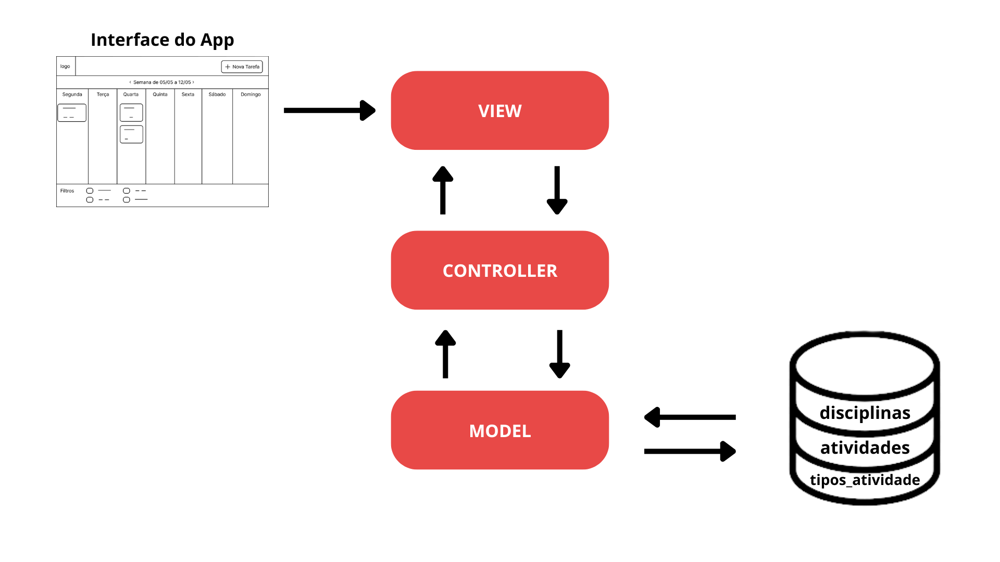
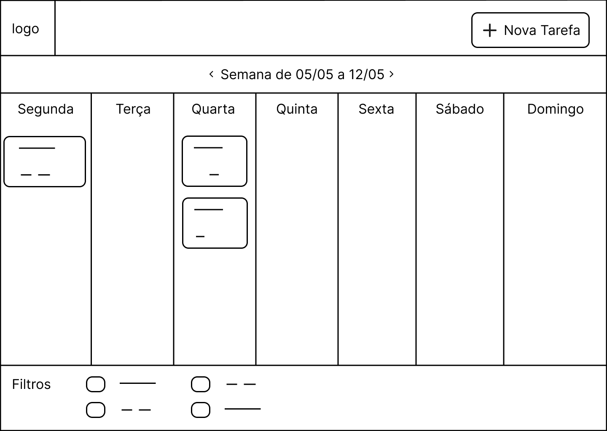
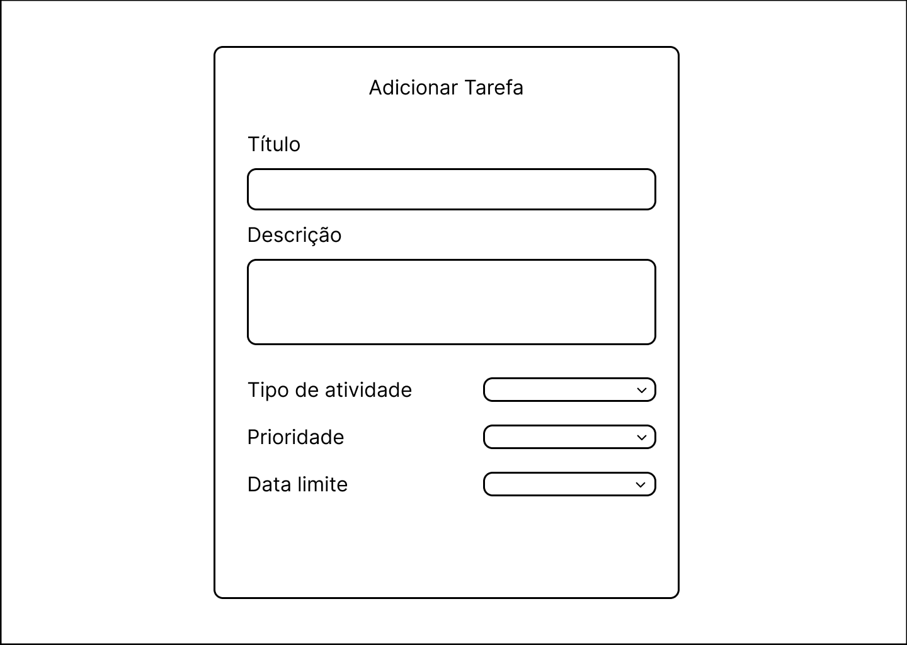
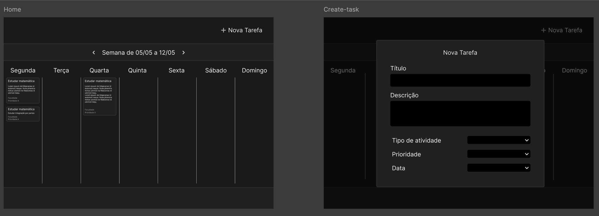
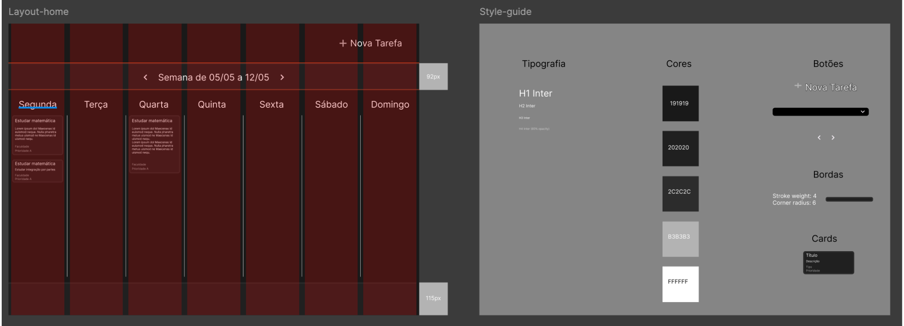

# Web Application Document - Projeto Individual - Módulo 2 - Inteli

## Task Manager

#### Guilherme Holanda Marques

## Sumário

1. [Introdução](#c1)  
2. [Visão Geral da Aplicação Web](#c2)  
3. [Projeto Técnico da Aplicação Web](#c3)  
4. [Desenvolvimento da Aplicação Web](#c4)  
5. [Referências](#c5)  

 

## 1. Introdução (Semana 01)

Neste projeto, será desenvolvido um **Gerenciador de Tarefas para Estudantes Universitários**,  com foco em organização acadêmica individual. A aplicação tem como objetivo ajudar alunos de graduação a:

- Registrar e categorizar tarefas por disciplina ou tipo de atividade;
- Definir prazos de entrega e lembretes de provas e sessões de estudo;
- Priorizar atividades (ex.: trabalhos, leituras, revisões) e acompanhar o progresso em uma **visão semanal**;

A solução adota arquitetura full-stack, integrando banco de dados, backend e frontend via API para garantir consistência e desempenho. Ao final, espera-se entregar uma ferramenta leve e intuitiva que auxilie universitários a planejar suas semanas acadêmicas de forma prática.

---

## 2. Visão Geral da Aplicação Web

### 2.1. Personas

### 2.2. User Stories

| ID | User Story |
| --- | --- |
| US01 | Como estudante universitário, quero **cadastrar uma tarefa** com título, descrição, disciplina e prazo, para que eu possa organizar minhas atividades acadêmicas. |
| US02 | Como estudante universitário, quero **visualizar minhas tarefas em uma visão semanal**, para que eu saiba exatamente o que preciso entregar em cada dia da semana. |
| US03 | Como estudante universitário, quero **receber lembretes antes do vencimento** das tarefas, para que eu não perca prazos importantes. |

---

### INVEST da US02

> US02 | Como estudante universitário, quero visualizar minhas tarefas em uma visão semanal, para que eu saiba exatamente o que preciso entregar em cada dia da semana.
> 
- **I – Independente**
    
    A implementação da visão semanal pode ser feita isoladamente, consumindo a lista de tarefas já cadastradas, sem depender de criação ou edição de tarefas.
    
- **N – Negociável**
    
    O layout (cores, estilo de calendário, número de tarefas exibidas por dia) pode ser ajustado conforme feedback, sem afetar o comportamento central.
    
- **V – Valiosa**
    
    Oferece ao usuário um panorama claro da semana, reduzindo ansiedade e ajudando na priorização das atividades.
    
- **E – Estimável**
    
    É possível estimar horas para:
    
    1. Consumir a API de tarefas;
    2. Renderizar o componente de calendário;
    3. Testar responsividade e interações.
- **S – Pequena (Small)**
    
    A primeira versão pode exibir apenas blocos com título e prazo, sem detalhes avançados (como arrastar tarefas), mantendo o escopo contido.
    
- **T – Testável**
    
    Testes automatizados ou manuais podem verificar se:
    
    - Todas as tarefas aparecem no dia correto;
    - A semana inicial e final estão corretas;
    - A visualização reage bem a diferentes tamanhos de tela.

---

## 3. Projeto da Aplicação Web

### 3.1. Modelagem do banco de dados  (Semana 3)

*Posicione aqui os diagramas de modelos relacionais do seu banco de dados, apresentando todos os esquemas de tabelas e suas relações. Utilize texto para complementar suas explicações, se necessário.*

*Posicione também o modelo físico com o Schema do BD (arquivo .sql)*

### 3.1.1 BD e Models

O banco de dados PostgreSQL foi inicializado via script SQL (`init.sql`), criando as seguintes tabelas:

- **disciplinas**  
  - `id` (PK)  
  - `nome`  
- **tipos_atividade**  
  - `id` (PK)  
  - `nome`  
- **atividades**  
  - `id` (PK)  
  - `titulo`  
  - `descricao`  
  - `data_criacao` (TIMESTAMP)  
  - `data_limite` (DATE)  
  - `status`  
  - `prioridade`  
  - `disciplina_id` (FK → `disciplinas.id`)  
  - `tipo_id` (FK → `tipos_atividade.id`)  

Os **Models** foram implementados em `models/Tarefa.js`, expondo métodos assíncronos para `create`, `findAll`, `findById`, `update` e `remove`, todos executando SQL puro via `pg`.

### 3.2 Arquitetura

A aplicação segue o padrão **MVC**:

- **Model:**  
  Tabelas e lógica de acesso ao banco (em `models/Tarefa.js`), usando o pacote `pg`.  
- **Controller:**  
  `controllers/TarefaController.js` recebe as requisições, chama os métodos de Model e devolve JSON.  
- **View:**  
  Nesta parte do módulo, atuamos apenas como API; o frontend consome JSON via HTTP.  

> Fluxo:  
> 1. Cliente faz requisição HTTP →  
> 2. **Controller** processa →  
> 3. chama **Model** (SQL via `pg`) →  
> 4. retorna dados →  
> 5. Controller envia JSON →  
> 6. Cliente consome resposta.

### 3.3. Wireframes (Semana 03)

A seguir, apresento os wireframes das telas principais do Gerenciador de Tarefas, alinhados às User Stories:

---

#### 3.3.1 Tela Principal (Visão Semanal)

- **Objetivo (US02):** permitir ao usuário visualizar todas as tarefas da semana de forma clara.
- **Componentes principais:**
    - **Cabeçalho**
        - Logo / nome da aplicação (esquerda)
        - Botão “+ Nova tarefa” (direita)
    - **Navegação de datas**
        - Setas “<” e “>” para navegar entre semanas
        - Indicador da semana atual (ex: “Semana de 05/05 a 11/05”)
    - **Grade Semanal**
        - 7 colunas (segunda a domingo)
        - Cada coluna exibe cartões de tarefas com:
            - **Título**
            - **Prazo** (hora)
            - **Prioridade** (ícone ou cor de borda)
    - **Legenda / Filtros (opcional)**
        - Checkboxes para filtrar por disciplina ou prioridade

---

#### 3.3.2 Tela de Criação/Edição de Tarefa

- **Objetivo (US01, US03):** cadastrar nova tarefa com todos os detalhes necessários.
- **Componentes principais:**
    - **Formulário**
        - Campo “Título” (input text)
        - Campo “Descrição” (textarea)
        - Dropdown “Tipo de atividade”
        - Campo “Data limite” (date picker)
        - Radio buttons ou dropdown “Prioridade”

---

> Relação com as User Stories
> 
> - **US02:** Tela Principal exibe a visão semanal.
> - **US01 & US03:** Tela de Criação/Edição cobre cadastro de tarefas e geração de lembrete.

Os wireframes de baixa fidelidade focam na estrutura e navegação, garantindo que os fluxos principais (listar, criar e editar tarefas) estejam contemplados antes de avançar para o design de alta fidelidade.

### 3.4. Guia de estilos (Semana 05)

*Descreva aqui orientações gerais para o leitor sobre como utilizar os componentes do guia de estilos de sua solução.*

### 3.5. Protótipo de alta fidelidade (Semana 05)

 

 

### 3.6 WebAPI e Endpoints

| Método | Rota                 | Controller                    | Descrição                         |
| ------ | -------------------- | ----------------------------- | --------------------------------- |
| POST   | `/api/tarefas`       | `TarefaController.criarTarefa`  | Cria uma nova tarefa              |
| GET    | `/api/tarefas`       | `TarefaController.listarTarefas`| Lista todas as tarefas            |
| GET    | `/api/tarefas/:id`   | `TarefaController.buscarTarefa` | Busca uma tarefa por ID           |
| PUT    | `/api/tarefas/:id`   | `TarefaController.editarTarefa` | Atualiza os dados de uma tarefa   |
| DELETE | `/api/tarefas/:id`   | `TarefaController.excluirTarefa`| Remove uma tarefa pelo ID         |

### 3.7 Interface e Navegação (Semana 07)

*Descreva e ilustre aqui o desenvolvimento do frontend do sistema web, explicando brevemente o que foi entregue em termos de código e sistema. Utilize prints de tela para ilustrar.*

---

## 4. Desenvolvimento da Aplicação Web (Semana 8)

### 4.1 Demonstração do Sistema Web (Semana 8)

*VIDEO: Insira o link do vídeo demonstrativo nesta seção*
*Descreva e ilustre aqui o desenvolvimento do sistema web completo, explicando brevemente o que foi entregue em termos de código e sistema. Utilize prints de tela para ilustrar.*

### 4.2 Conclusões e Trabalhos Futuros (Semana 8)

*Indique pontos fortes e pontos a melhorar de maneira geral.*
*Relacione também quaisquer outras ideias que você tenha para melhorias futuras.*

## 5. Referências

_Incluir as principais referências de seu projeto, para que seu parceiro possa consultar caso ele se interessar em aprofundar. Um exemplo de referência de livro e de site:_ 

---
---